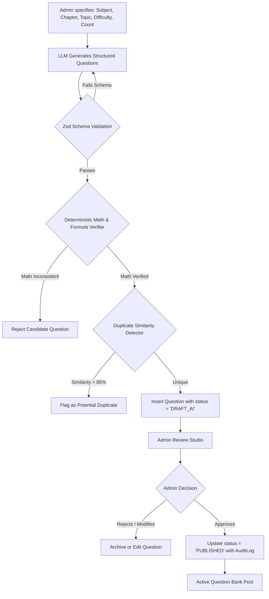

# AI Learning Architecture & Guardrails — CDSPrep

**Package Location:** `packages/ai`  
**Purpose:** Contextual Explanations, Diagnostic Study Advisory, and Validated Question Synthesis  
**Platform:** CDSPrep

---

## 1. Architectural Philosophy: Bounded & Deterministic AI

In accordance with Platform Rules 21–24:

- **AI is never used indiscriminately**: AI is isolated to specific, high-leverage domains (contextual explanations, assisted draft generation, and personalized revision advisory).
- **Zero Hallucination Tolerance on Exams**: Active exam scoring and answers are 100% deterministic, backed by verified human-curated keys.
- **Provider Agnostic**: All LLM interactions sit behind an adapter interface (`packages/ai/src/provider.ts`), permitting zero-friction switching between OpenAI (GPT-4o), Google (Gemini 2.0 / 3.0), or local models without rewriting application logic.
- **Strict Privacy Sandboxing**: The AI Assistant only receives anonymized, aggregated user statistics (e.g., topic accuracy percentages). PII, email addresses, and other candidates' data are never included in prompts.

---

## 2. Package Architecture (`packages/ai`)

```text
packages/ai/
├── src/
│   ├── index.ts                     # Public package exports
│   ├── provider.ts                  # Abstract Base Provider Interface
│   ├── providers/
│   │   ├── openai.provider.ts       # OpenAI implementation
│   │   ├── gemini.provider.ts       # Google Gemini implementation
│   │   └── mock.provider.ts         # Development & CI test provider
│   ├── prompts/
│   │   ├── explanation.prompts.ts   # Contextual question simplification prompts
│   │   ├── advisor.prompts.ts       # Study assistant & weakness diagnostic prompts
│   │   └── generation.prompts.ts    # CDS exam question drafting prompts
│   ├── schemas/
│   │   ├── question.schema.ts       # Zod JSON Schema for structured LLM outputs
│   │   └── advisor.schema.ts        # Structured response schemas for study advice
│   ├── validation/
│   │   ├── math-validator.ts        # Deterministic algebraic & numerical evaluator
│   │   └── duplicate-detector.ts    # Jaccard / Vector similarity duplicate filter
│   └── services/
│       ├── explanation.service.ts   # Service for question deep dives
│       ├── advisor.service.ts       # Service for aspirant study queries
│       └── generator.service.ts     # Service for admin candidate question generation
└── package.json
```

---

## 3. Provider Abstraction Interface (`provider.ts`)

```typescript
export interface AICompletionOptions {
  temperature?: number;
  maxTokens?: number;
  jsonSchema?: object; // Structured Output constraint
}

export interface AIProvider {
  name: string;
  generateText(
    prompt: string,
    systemPrompt?: string,
    options?: AICompletionOptions,
  ): Promise<string>;
  generateStructured<T>(
    prompt: string,
    schema: any,
    systemPrompt?: string,
    options?: AICompletionOptions,
  ): Promise<T>;
}
```

---

## 4. Contextual Question Explanation Engine

Aspirants reviewing test results or drilling in practice mode can invoke targeted conceptual assistance:

```
[Candidate Views Question]
       │
       ├── "Explain Simply" ──────────► [Generate foundational concept breakdown]
       ├── "Why is Option B wrong?" ──► [Targeted distractor analysis]
       ├── "Step-by-Step Derivation" ─► [KaTeX step-by-step mathematical proof]
       └── "Give Similar Question" ───► [Query database for identical topic/difficulty]
```

### 4.1 Grounding Guardrail

The prompt strictly anchors the LLM to the provided question text, options, and official solution. The model is forbidden from answering general or out-of-scope queries inside the question explanation modal.

---

## 5. Admin AI Question Generation Workflow (Human-in-the-Loop)



### 5.1 Deterministic Mathematical Verification (`math-validator.ts`)

For Elementary Mathematics questions (Arithmetic, Algebra, Trigonometry):

1. **Equation Parsing**: Extracts embedded LaTeX equations using regular expressions.
2. **Formula Execution**: Uses a sandboxed symbolic mathematics evaluator (`mathjs`) to evaluate expressions independently.
3. **Consistency Check**: Verifies that the correct option evaluates to the exact computed mathematical result. If the LLM generates a question where $2x + 5 = 15 \implies x = 4$, the validator automatically flags and drops the question before it ever reaches the admin queue.

---

## 6. AI Study Assistant & Privacy Architecture

The Study Assistant answers student preparation inquiries:

- _"What topic should I study today?"_
- _"Why did my English score decrease in Mock 3?"_
- _"Give me a 3-day revision timetable for Indian Polity."_

### 6.1 Anonymized Context Injection

When querying the assistant, the API server builds a redacted context object:

```json
{
  "targetAcademy": "IMA",
  "historicalAccuracy": {
    "English": "74.2%",
    "General Knowledge": "51.8%",
    "Elementary Mathematics": "68.0%"
  },
  "criticalWeakTopics": [
    { "topic": "Modern Freedom Movement", "accuracy": "38%" },
    { "topic": "Trigonometric Identities", "accuracy": "45%" }
  ],
  "recentTestHistory": [
    { "testName": "CDS Mock 1", "score": "142.5/300", "percentile": "78%" },
    { "testName": "CDS Mock 2", "score": "151.0/300", "percentile": "82%" }
  ]
}
```

**No private names, passwords, emails, or student IDs are ever transmitted to the LLM.**
