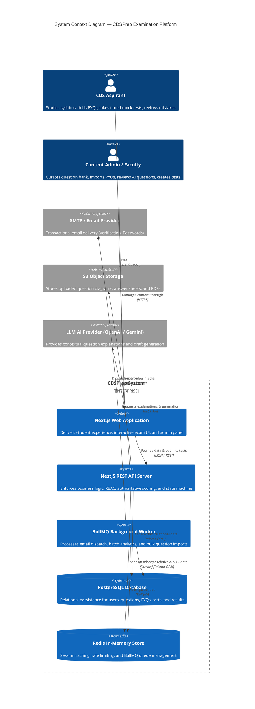
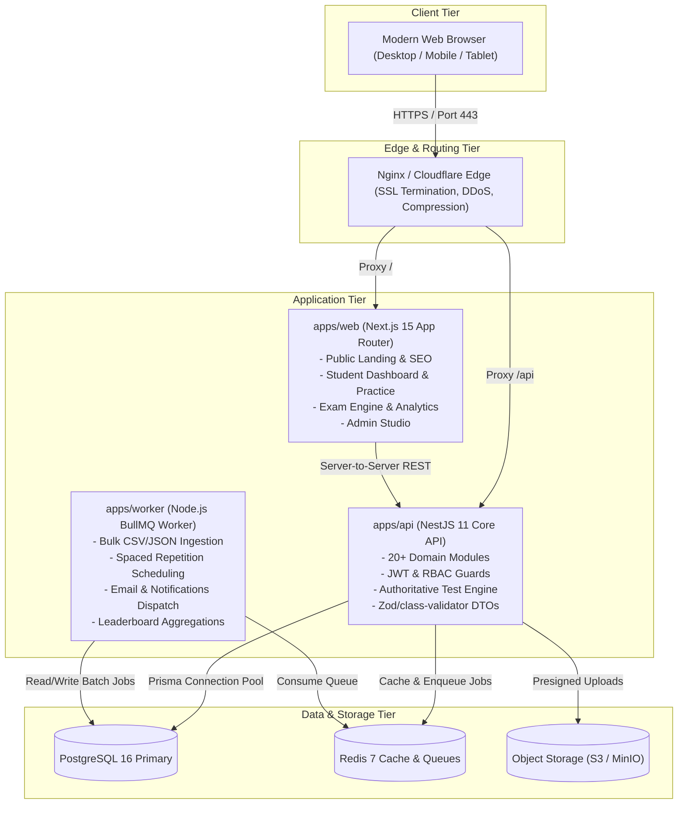
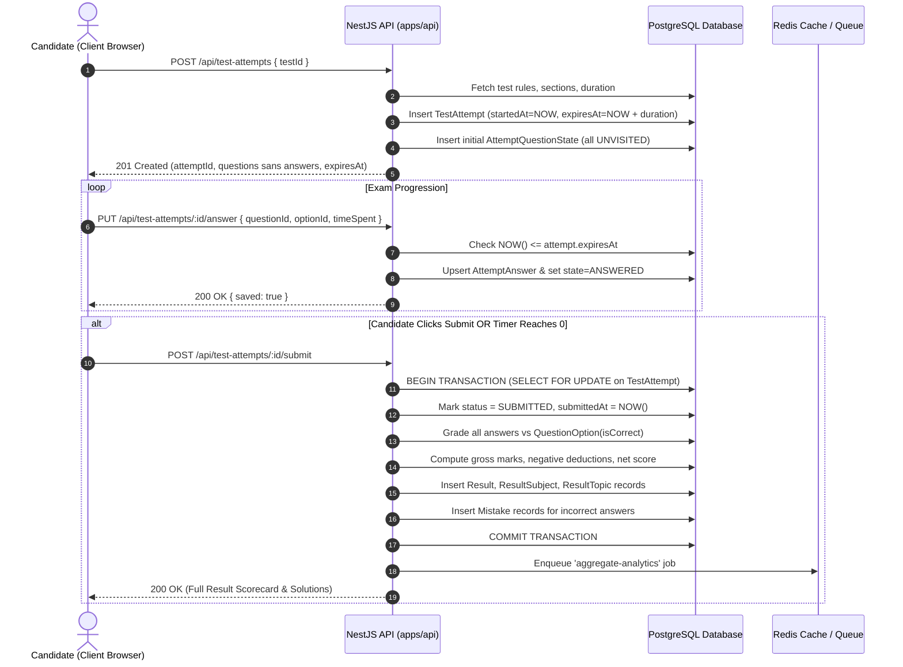
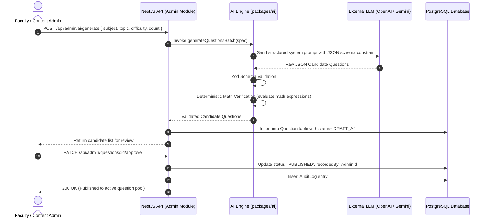

# System Architecture & Monorepo Design — CDSPrep

**Document:** System Architecture & Monorepo Design  
**Framework:** C4 Architectural Model + Monorepo Layout  
**Platform:** CDSPrep

---

## 1. High-Level Architecture Overview (C4 Context Diagram)



---

## 2. Container Diagram (C4 Containers)



---

## 3. Monorepo Structural Specification

```text
cdsprep/
├── apps/
│   ├── web/
│   │   ├── app/
│   │   │   ├── (public)/                 # Landing, About, Pricing, Contact, FAQ, Terms
│   │   │   ├── (auth)/                   # Login, Register, Forgot Password, Reset Password
│   │   │   ├── (student)/                # Authenticated Aspirant Shell
│   │   │   │   ├── dashboard/            # Performance cards, quick actions, streaks
│   │   │   │   ├── practice/             # All, Subject, Chapter, Topic drills
│   │   │   │   ├── pyq/                  # 20-Year PYQ browser, Year/Session/Paper
│   │   │   │   ├── tests/                # Full mocks, Subject tests, Custom tests
│   │   │   │   ├── test/[testId]/        # Instructions, Live Exam Interface, Review
│   │   │   │   ├── result/[attemptId]/   # Granular scorecards, KaTeX solution view
│   │   │   │   ├── analytics/            # Longitudinal charts, weakness matrix
│   │   │   │   ├── mistakes/             # Automatic mistake notebook & retry mode
│   │   │   │   ├── bookmarks/            # Saved questions & custom drills
│   │   │   │   ├── leaderboard/          # Academy-wise & overall rankings
│   │   │   │   ├── study-plan/           # AI & deterministic daily revision plans
│   │   │   │   ├── ai-assistant/         # Contextual CDS study assistant
│   │   │   │   └── profile/              # User settings, Academy target (IMA/OTA)
│   │   │   └── (admin)/                  # Dedicated Admin & Faculty Portal
│   │   │       ├── admin/dashboard/      # System statistics & active tests
│   │   │       ├── admin/questions/      # CRUD question bank, KaTeX editor, filters
│   │   │       ├── admin/questions/import# CSV/JSON bulk ingestion & report download
│   │   │       ├── admin/pyq/            # PYQ Paper management & session linking
│   │   │       ├── admin/tests/          # Test creation, sections, marks & duration
│   │   │       ├── admin/subjects/       # Syllabus taxonomy manager (Subject->Chapter->Topic)
│   │   │       ├── admin/ai/             # AI question generator & approval queue
│   │   │       ├── admin/reports/        # Student question flag moderation
│   │   │       └── admin/audit-logs/     # Immutable administrative action log
│   │   ├── components/                   # Web-specific UI components
│   │   ├── hooks/                        # Custom React hooks (e.g., useExamTimer, useAutosave)
│   │   ├── lib/                          # Web utilities, API client, KaTeX wrapper
│   │   └── package.json
│   ├── api/
│   │   ├── src/
│   │   │   ├── main.ts                   # Fastify/Express bootstrap, Swagger setup
│   │   │   ├── app.module.ts             # Root module aggregating all feature modules
│   │   │   ├── common/                   # Shared guards, interceptors, filters, pipes
│   │   │   └── modules/                  # 20+ cleanly separated domain modules
│   │   ├── test/                         # E2E & integration test suites
│   │   └── package.json
│   └── worker/
│       ├── src/
│       │   ├── main.ts                   # BullMQ worker runtime bootstrap
│       │   └── processors/               # Email, Analytics, Import, AI validation processors
│       └── package.json
├── packages/
│   ├── ui/                               # Shared React component primitives (Radix + Tailwind)
│   ├── database/                         # Prisma schema, migrations, seeders, client singleton
│   ├── types/                            # Cross-cutting TypeScript definitions & Enums
│   ├── validation/                       # Zod validation schemas shared between client and server
│   ├── config/                           # Prettier, ESLint, TypeScript base configurations
│   └── ai/                               # LLM provider abstraction, prompt templates, math validator
├── docs/                                 # Complete technical & product documentation
├── docker/                               # Production Dockerfiles for web, api, and worker
├── docker-compose.yml                    # Local multi-container development environment
├── package.json                          # Root workspace configuration
└── pnpm-workspace.yaml                   # Monorepo directory map
```

---

## 4. Key Architectural Data Flows

### 4.1 Test Attempt Lifecycle (Authoritative Execution)



### 4.2 AI Question Generation & Human-in-the-Loop Validation



---

## 5. Technology Decision Records (TDRs)

### TDR-01: Next.js App Router for Frontend

- **Context**: The application requires both public-facing, highly indexable SEO pages (Landing, About, CDS Syllabus, PYQ overviews) and interactive client-driven exam applications.
- **Decision**: Adopt Next.js 15+ App Router.
- **Consequences**: Public pages use React Server Components (RSC) for zero-bundle HTML rendering; exam and dashboard views use client components (`"use client"`) backed by TanStack Query for reactive, stateful experiences.

### TDR-02: NestJS for Backend Services

- **Context**: The backend requires 20+ interconnected domain modules, strict DTO validation, role-based authorization guards, and clear separation of concerns.
- **Decision**: Use NestJS with TypeScript.
- **Consequences**: Provides structured enterprise design patterns (Modules, Controllers, Services, Guards, Interceptors) out of the box, standardizing development across team members and preventing architecture decay.

### TDR-03: PostgreSQL with Prisma ORM

- **Context**: Exam scoring, negative marking, attempt states, and student analytics demand strict relational integrity, foreign keys, and atomic transactions (`$transaction`).
- **Decision**: PostgreSQL 16 with Prisma ORM.
- **Consequences**: Guarantees acid compliance for submissions; provides end-to-end type safety between database models and API logic; simplifies database migrations.

### TDR-04: KaTeX for Mathematical Typesetting

- **Context**: CDS Elementary Mathematics involves fractions, square roots, geometry symbols, quadratic equations, and trigonometry identities ($0^\circ \le \theta \le 90^\circ$).
- **Decision**: Use KaTeX over MathJax.
- **Consequences**: KaTeX is up to 100x faster than MathJax, compiles synchronously, supports server-side rendering, and maintains a tiny client-side footprint.

### TDR-05: Server-Authoritative Exam Timing

- **Context**: Relying on browser `setInterval` causes exam desynchronization when tabs are backgrounded or when users alter system clocks.
- **Decision**: The backend calculates `expiresAt = startedAt + duration` upon attempt creation and independently evaluates expiry on every mutation.
- **Consequences**: Total immunity against client-side timer manipulation; seamless recovery across browser restarts and device switches.
