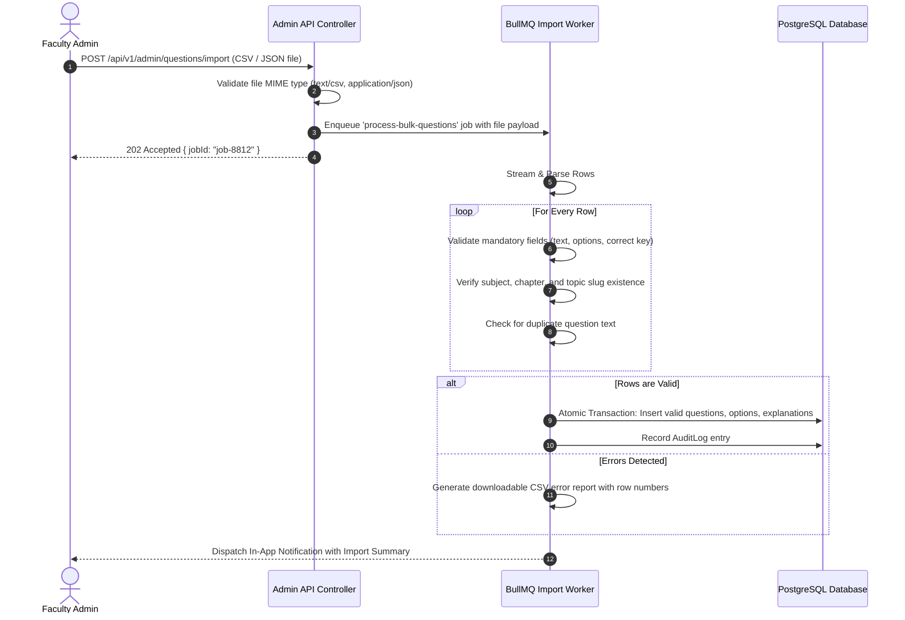

# Content Management System & PYQ Ingestion Pipeline — CDSPrep

**Document:** Content Management, Ingestion Pipeline & Quality Assurance  
**Platform:** CDSPrep

---

## 1. 20-Year CDS PYQ Architecture (2006 – 2026)

The UPSC Combined Defence Services examination is conducted twice annually (`CDS-I` in April and `CDS-II` in September). CDSPrep organizes 20 years of historical papers under a standardized hierarchy:

```
CDS Previous Year Questions (PYQ)
 └── Year (e.g., 2024)
      ├── Session: CDS-I (April)
      │    ├── Paper 1: English (120 Questions)
      │    ├── Paper 2: General Knowledge (120 Questions)
      │    └── Paper 3: Elementary Mathematics (100 Questions)
      └── Session: CDS-II (September)
           ├── Paper 1: English (120 Questions)
           ├── Paper 2: General Knowledge (120 Questions)
           └── Paper 3: Elementary Mathematics (100 Questions)
```

### 1.1 Legal Compliance & Ingestion Ethics

- **Public Domain Attribution**: UPSC examination question papers are official public documents in India. CDSPrep formats and tags these questions with appropriate public source citations (e.g., _"Source: UPSC CDS (I) 2023, Paper 3, Q42"_).
- **Zero Proprietary Scraping**: The platform strictly prohibits scraping copyrighted answer keys or proprietary third-party book solutions. All detailed explanations and KaTeX derivations are original editorial content crafted by verified faculty.

---

## 2. Comprehensive Question Data Schema

Every question within the CDSPrep ecosystem conforms to the following schema:

```typescript
interface QuestionModel {
  id: string;                    // UUID v4
  subjectSlug: string;           // 'english' | 'gk' | 'elementary-maths'
  chapterSlug: string;           // e.g. 'arithmetic'
  topicSlug: string;             // e.g. 'percentages-profit-loss'
  questionType:                  // 'MCQ_SINGLE' | 'ASSERTION_REASON' | 'STATEMENT_BASED' | 'MATCHING' | 'COMPREHENSION'
  questionText: string;          // Rich text supporting KaTeX ($...$ and $$...$$)
  marks: number;                 // 1.00 (Maths) or 0.83 (English/GK)
  negativeMarks: number;         // 0.33 (Maths) or 0.28 (English/GK)
  difficulty: 'EASY' | 'MEDIUM' | 'HARD';
  status: 'DRAFT' | 'DRAFT_AI' | 'IN_REVIEW' | 'PUBLISHED' | 'ARCHIVED';
  source: string;                // e.g. 'UPSC CDS II 2022'
  year?: number;                 // 2022
  session?: 'CDS-I' | 'CDS-II';  // 'CDS-II'
  options: Array<{
    identifier: 'A' | 'B' | 'C' | 'D';
    optionText: string;          // Rich text supporting KaTeX
    isCorrect: boolean;
  }>;
  explanation: {
    explanationText: string;     // Complete step-by-step KaTeX derivation
    keyConcept?: string;         // 'Boyle's Law', 'Remainder Theorem'
    trickFormula?: string;       // Fast mental math shortcut
  };
  tags: string[];                // ['PYQ', 'High-Yield', 'CDS-2022']
}
```

---

## 3. Mathematical & KaTeX Formatting Standards

To ensure uniform rendering across web and mobile viewports, all content creators follow strict KaTeX syntax rules:

1. **Inline Math**: Wrapped in single dollar signs: `$x^2 + y^2 = r^2$`.
2. **Block / Display Math**: Wrapped in double dollar signs:
   $$\int_{0}^{\pi} \sin(x) \, dx = 2$$
3. **Trigonometry & Geometry Standards**:
   - Degrees explicitly formatted with `^\circ`: `$\sin(30^\circ) = \frac{1}{2}$`.
   - Right angles and triangles: `$\triangle ABC \cong \triangle DEF$`.
   - Ratios and percentages: `$\text{Profit \%} = \frac{\text{SP} - \text{CP}}{\text{CP}} \times 100$`.

---

## 4. Bulk Question Import Pipeline (CSV / JSON)

Administrators and faculty can upload question batches via `/admin/questions/import`.



### 4.1 Sample CSV Header Format

```csv
subject_slug,chapter_slug,topic_slug,difficulty,marks,negative_marks,source,year,session,question_text,option_a,option_b,option_c,option_d,correct_option,explanation
elementary-maths,trigonometry,heights-and-distances,MEDIUM,1.00,0.33,UPSC CDS I 2023,2023,CDS-I,"A ladder 15 m long just reaches the top of a vertical wall. If the ladder makes an angle of $60^\circ$ with the wall, find the height of the wall.","15 m","$7.5\sqrt{3}$ m","7.5 m","10 m",B,"Let height of wall be $h$. $\cos(60^\circ) = \frac{h}{15} \implies h = 15 \times \frac{\sqrt{3}}{2} = 7.5\sqrt{3}\text{ m}$."
```

### 4.2 Ingestion Report Payload

```json
{
  "totalRows": 120,
  "validRows": 118,
  "invalidRows": 2,
  "insertedRows": 118,
  "errors": [
    {
      "row": 44,
      "field": "topic_slug",
      "error": "Topic 'unknown-topic' does not exist in chapter 'geometry'"
    },
    { "row": 92, "field": "correct_option", "error": "Value 'E' is invalid; must be A, B, C, or D" }
  ]
}
```

---

## 5. Question Versioning & Audit Control

To maintain academic integrity:

- **Versioning**: When a published question is modified, an immutable snapshot is preserved in `AuditLog` including previous text, options, and author metadata.
- **Content Flagging Workflow**: If three or more students submit a `QuestionReport` on a question, it is automatically marked with a yellow review banner in the faculty queue.
