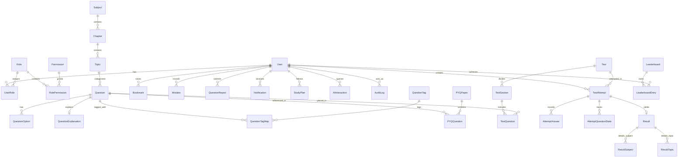

# Database Architecture & Schema Specification — CDSPrep

**Database Engine:** PostgreSQL 16+  
**ORM:** Prisma ORM 6+  
**Platform:** CDSPrep

---

## 1. Entity-Relationship Diagram (ERD)



---

## 2. Complete Prisma Schema Specification

Below is the definitive Prisma schema (`packages/database/prisma/schema.prisma`) defining all 30+ relational entities and enums:

```prisma
datasource db {
  provider = "postgresql"
  url      = env("DATABASE_URL")
}

generator client {
  provider = "prisma-client-js"
}

// --------------------------------------------------------
// ENUMS
// --------------------------------------------------------

enum RoleType {
  STUDENT
  CONTENT_EDITOR
  MODERATOR
  ADMIN
  SUPER_ADMIN
}

enum AcademyTarget {
  IMA
  INA
  AFA
  OTA
  UNDECIDED
}

enum DifficultyLevel {
  EASY
  MEDIUM
  HARD
}

enum QuestionType {
  MCQ_SINGLE
  ASSERTION_REASON
  STATEMENT_BASED
  MATCHING
  COMPREHENSION
}

enum QuestionStatus {
  DRAFT
  DRAFT_AI
  IN_REVIEW
  PUBLISHED
  ARCHIVED
}

enum QuestionPaletteState {
  UNVISITED
  NOT_ANSWERED
  ANSWERED
  MARKED_FOR_REVIEW
  ANSWERED_AND_MARKED_FOR_REVIEW
  VISITED
}

enum AttemptStatus {
  IN_PROGRESS
  SUBMITTED
  AUTO_SUBMITTED_TIMEOUT
  ABANDONED
}

enum ReportStatus {
  PENDING
  REVIEWED
  RESOLVED
  REJECTED
}

enum PlanFrequency {
  DAILY
  WEEKLY
}

enum MistakeStatus {
  ACTIVE
  RETRY_CORRECT
  MASTERED
}

// --------------------------------------------------------
// 1. AUTHENTICATION & ACCESS CONTROL
// --------------------------------------------------------

model User {
  id                    String            @id @default(uuid()) @db.Uuid
  email                 String            @unique @db.VarChar(255)
  passwordHash          String            @db.VarChar(255)
  fullName              String            @db.VarChar(100)
  targetAcademy         AcademyTarget     @default(IMA)
  isEmailVerified       Boolean           @default(false)
  verificationToken     String?           @db.VarChar(255)
  resetPasswordToken    String?           @db.VarChar(255)
  resetPasswordExpires  DateTime?
  avatarUrl             String?           @db.VarChar(512)
  currentStreak         Int               @default(0)
  highestStreak         Int               @default(0)
  lastActiveDate        DateTime?         @db.Date
  createdAt             DateTime          @default(now())
  updatedAt             DateTime          @updatedAt
  deletedAt             DateTime?

  roles                 UserRole[]
  attempts              TestAttempt[]
  bookmarks             Bookmark[]
  mistakes              Mistake[]
  reports               QuestionReport[]
  notifications         Notification[]
  studyPlans            StudyPlan[]
  aiInteractions        AIInteraction[]
  auditLogs             AuditLog[]
  leaderboardEntries    LeaderboardEntry[]

  @@index([email])
  @@index([deletedAt])
  @@map("users")
}

model Role {
  id          String           @id @default(uuid()) @db.Uuid
  name        RoleType         @unique
  description String?          @db.VarChar(255)
  createdAt   DateTime         @default(now())

  users       UserRole[]
  permissions RolePermission[]

  @@map("roles")
}

model Permission {
  id          String           @id @default(uuid()) @db.Uuid
  action      String           @unique @db.VarChar(100) // e.g., 'question:create', 'test:publish'
  description String?          @db.VarChar(255)
  createdAt   DateTime         @default(now())

  roles       RolePermission[]

  @@map("permissions")
}

model UserRole {
  id        String   @id @default(uuid()) @db.Uuid
  userId    String   @db.Uuid
  roleId    String   @db.Uuid
  createdAt DateTime @default(now())

  user      User     @relation(fields: [userId], references: [id], onDelete: Cascade)
  role      Role     @relation(fields: [roleId], references: [id], onDelete: Cascade)

  @@unique([userId, roleId])
  @@map("user_roles")
}

model RolePermission {
  id           String     @id @default(uuid()) @db.Uuid
  roleId       String     @db.Uuid
  permissionId String     @db.Uuid

  role         Role       @relation(fields: [roleId], references: [id], onDelete: Cascade)
  permission   Permission @relation(fields: [permissionId], references: [id], onDelete: Cascade)

  @@unique([roleId, permissionId])
  @@map("role_permissions")
}

// --------------------------------------------------------
// 2. SYLLABUS TAXONOMY
// --------------------------------------------------------

model Subject {
  id          String    @id @default(uuid()) @db.Uuid
  slug        String    @unique @db.VarChar(50) // 'english', 'gk', 'elementary-maths'
  name        String    @db.VarChar(100)
  description String?   @db.Text
  icon        String?   @db.VarChar(50)
  orderIndex  Int       @default(0)
  createdAt   DateTime  @default(now())

  chapters    Chapter[]
  questions   Question[]
  tests       Test[]

  @@map("subjects")
}

model Chapter {
  id          String     @id @default(uuid()) @db.Uuid
  subjectId   String     @db.Uuid
  name        String     @db.VarChar(150)
  slug        String     @db.VarChar(150)
  orderIndex  Int        @default(0)
  createdAt   DateTime   @default(now())

  subject     Subject    @relation(fields: [subjectId], references: [id], onDelete: Cascade)
  topics      Topic[]
  questions   Question[]

  @@unique([subjectId, slug])
  @@index([subjectId])
  @@map("chapters")
}

model Topic {
  id          String     @id @default(uuid()) @db.Uuid
  chapterId   String     @db.Uuid
  name        String     @db.VarChar(150)
  slug        String     @db.VarChar(150)
  orderIndex  Int        @default(0)
  createdAt   DateTime   @default(now())

  chapter     Chapter    @relation(fields: [chapterId], references: [id], onDelete: Cascade)
  questions   Question[]

  @@unique([chapterId, slug])
  @@index([chapterId])
  @@map("topics")
}

// --------------------------------------------------------
// 3. QUESTION BANK
// --------------------------------------------------------

model Question {
  id             String          @id @default(uuid()) @db.Uuid
  subjectId      String          @db.Uuid
  chapterId      String          @db.Uuid
  topicId        String          @db.Uuid
  questionType   QuestionType    @default(MCQ_SINGLE)
  questionText   String          @db.Text // Supports KaTeX
  marks          Decimal         @default(1.00) @db.Decimal(5, 2)
  negativeMarks  Decimal         @default(0.33) @db.Decimal(5, 2)
  difficulty     DifficultyLevel @default(MEDIUM)
  status         QuestionStatus  @default(PUBLISHED)
  source         String?         @db.VarChar(150) // e.g., 'CDS I 2024'
  createdById    String?         @db.Uuid
  createdAt      DateTime        @default(now())
  updatedAt      DateTime        @updatedAt
  deletedAt      DateTime?

  subject        Subject         @relation(fields: [subjectId], references: [id])
  chapter        Chapter         @relation(fields: [chapterId], references: [id])
  topic          Topic           @relation(fields: [topicId], references: [id])
  options        QuestionOption[]
  explanation    QuestionExplanation?
  tagMaps        QuestionTagMap[]
  pyqQuestions   PYQQuestion[]
  testQuestions  TestQuestion[]
  attemptAnswers AttemptAnswer[]
  bookmarks      Bookmark[]
  mistakes       Mistake[]
  reports        QuestionReport[]

  @@index([subjectId, chapterId, topicId, difficulty])
  @@index([status])
  @@map("questions")
}

model QuestionOption {
  id             String          @id @default(uuid()) @db.Uuid
  questionId     String          @db.Uuid
  identifier     String          @db.VarChar(5) // 'A', 'B', 'C', 'D'
  optionText     String          @db.Text // Supports KaTeX
  isCorrect      Boolean         @default(false)
  orderIndex     Int             @default(0)

  question       Question        @relation(fields: [questionId], references: [id], onDelete: Cascade)
  attemptAnswers AttemptAnswer[]

  @@unique([questionId, identifier])
  @@index([questionId])
  @@map("question_options")
}

model QuestionExplanation {
  id             String    @id @default(uuid()) @db.Uuid
  questionId     String    @unique @db.Uuid
  explanation    String    @db.Text // Rich explanation with KaTeX formulas
  keyConcept     String?   @db.VarChar(255)
  trickFormula   String?   @db.Text

  question       Question  @relation(fields: [questionId], references: [id], onDelete: Cascade)

  @@map("question_explanations")
}

model QuestionTag {
  id        String           @id @default(uuid()) @db.Uuid
  name      String           @unique @db.VarChar(50)
  tagMaps   QuestionTagMap[]

  @@map("question_tags")
}

model QuestionTagMap {
  questionId String      @db.Uuid
  tagId      String      @db.Uuid

  question   Question    @relation(fields: [questionId], references: [id], onDelete: Cascade)
  tag        QuestionTag @relation(fields: [tagId], references: [id], onDelete: Cascade)

  @@id([questionId, tagId])
  @@map("question_tag_maps")
}

// --------------------------------------------------------
// 4. PREVIOUS YEAR QUESTIONS (PYQ)
// --------------------------------------------------------

model PYQPaper {
  id          String        @id @default(uuid()) @db.Uuid
  year        Int           // e.g., 2024
  session     String        @db.VarChar(10) // 'CDS-I', 'CDS-II'
  subjectSlug String        @db.VarChar(50)
  title       String        @db.VarChar(150)
  totalMarks  Decimal       @db.Decimal(5, 2)
  durationMin Int           @default(120)
  createdAt   DateTime      @default(now())

  questions   PYQQuestion[]

  @@unique([year, session, subjectSlug])
  @@map("pyq_papers")
}

model PYQQuestion {
  id             String    @id @default(uuid()) @db.Uuid
  pyqPaperId     String    @db.Uuid
  questionId     String    @db.Uuid
  questionNumber Int

  paper          PYQPaper  @relation(fields: [pyqPaperId], references: [id], onDelete: Cascade)
  question       Question  @relation(fields: [questionId], references: [id], onDelete: Cascade)

  @@unique([pyqPaperId, questionNumber])
  @@index([pyqPaperId])
  @@map("pyq_questions")
}

// --------------------------------------------------------
// 5. TEST CONFIGURATION & SECTIONS
// --------------------------------------------------------

model Test {
  id              String         @id @default(uuid()) @db.Uuid
  title           String         @db.VarChar(200)
  slug            String         @unique @db.VarChar(200)
  description     String?        @db.Text
  subjectId       String?        @db.Uuid // Null for full CDS mock (multi-subject)
  isFullMock      Boolean        @default(false)
  targetAcademy   AcademyTarget  @default(IMA)
  durationMinutes Int            @default(120)
  totalMarks      Decimal        @db.Decimal(6, 2)
  passingMarks    Decimal?       @db.Decimal(6, 2)
  instructions    String?        @db.Text
  isPublished     Boolean        @default(false)
  createdAt       DateTime       @default(now())
  updatedAt       DateTime       @updatedAt

  subject         Subject?       @relation(fields: [subjectId], references: [id])
  sections        TestSection[]
  attempts        TestAttempt[]

  @@map("tests")
}

model TestSection {
  id              String         @id @default(uuid()) @db.Uuid
  testId          String         @db.Uuid
  name            String         @db.VarChar(100)
  orderIndex      Int            @default(0)
  durationMinutes Int?

  test            Test           @relation(fields: [testId], references: [id], onDelete: Cascade)
  testQuestions   TestQuestion[]

  @@index([testId])
  @@map("test_sections")
}

model TestQuestion {
  id            String       @id @default(uuid()) @db.Uuid
  testSectionId String       @db.Uuid
  questionId    String       @db.Uuid
  orderIndex    Int          @default(0)

  section       TestSection  @relation(fields: [testSectionId], references: [id], onDelete: Cascade)
  question      Question     @relation(fields: [questionId], references: [id], onDelete: Cascade)

  @@unique([testSectionId, questionId])
  @@index([testSectionId])
  @@map("test_questions")
}

// --------------------------------------------------------
// 6. EXAMINATION ENGINE, ATTEMPTS & RESULTS
// --------------------------------------------------------

model TestAttempt {
  id                     String                 @id @default(uuid()) @db.Uuid
  userId                 String                 @db.Uuid
  testId                 String                 @db.Uuid
  status                 AttemptStatus          @default(IN_PROGRESS)
  startedAt              DateTime               @default(now())
  expiresAt              DateTime               // Authoritative server-calculated deadline
  submittedAt            DateTime?
  timeSpentSeconds       Int                    @default(0)
  antiCheatEvents        Json?                  // Array of { event: string, timestamp: string }

  user                   User                   @relation(fields: [userId], references: [id], onDelete: Cascade)
  test                   Test                   @relation(fields: [testId], references: [id])
  answers                AttemptAnswer[]
  questionStates         AttemptQuestionState[]
  result                 Result?

  @@index([userId, status])
  @@index([testId])
  @@map("test_attempts")
}

model AttemptQuestionState {
  id            String               @id @default(uuid()) @db.Uuid
  testAttemptId String               @db.Uuid
  questionId    String               @db.Uuid
  state         QuestionPaletteState @default(UNVISITED)
  updatedAt     DateTime             @updatedAt

  attempt       TestAttempt          @relation(fields: [testAttemptId], references: [id], onDelete: Cascade)

  @@unique([testAttemptId, questionId])
  @@map("attempt_question_states")
}

model AttemptAnswer {
  id               String          @id @default(uuid()) @db.Uuid
  testAttemptId    String          @db.Uuid
  questionId       String          @db.Uuid
  selectedOptionId String?         @db.Uuid
  timeSpentSeconds Int             @default(0)
  createdAt        DateTime        @default(now())
  updatedAt        DateTime        @updatedAt

  attempt          TestAttempt     @relation(fields: [testAttemptId], references: [id], onDelete: Cascade)
  question         Question        @relation(fields: [questionId], references: [id])
  selectedOption   QuestionOption? @relation(fields: [selectedOptionId], references: [id])

  @@unique([testAttemptId, questionId])
  @@index([testAttemptId])
  @@map("attempt_answers")
}

model Result {
  id               String          @id @default(uuid()) @db.Uuid
  testAttemptId    String          @unique @db.Uuid
  totalQuestions   Int
  attemptedCount   Int
  correctCount     Int
  incorrectCount   Int
  skippedCount     Int
  grossMarks       Decimal         @db.Decimal(6, 2)
  negativeMarks    Decimal         @db.Decimal(6, 2)
  netScore         Decimal         @db.Decimal(6, 2)
  accuracyPercent  Decimal         @db.Decimal(5, 2)
  percentileRank   Decimal?        @db.Decimal(5, 2)
  createdAt        DateTime        @default(now())

  attempt          TestAttempt     @relation(fields: [testAttemptId], references: [id], onDelete: Cascade)
  subjectBreakdown ResultSubject[]
  topicBreakdown   ResultTopic[]

  @@map("results")
}

model ResultSubject {
  id              String   @id @default(uuid()) @db.Uuid
  resultId        String   @db.Uuid
  subjectName     String   @db.VarChar(100)
  totalQuestions  Int
  correctCount    Int
  incorrectCount  Int
  netScore        Decimal  @db.Decimal(6, 2)
  accuracyPercent Decimal  @db.Decimal(5, 2)

  result          Result   @relation(fields: [resultId], references: [id], onDelete: Cascade)

  @@index([resultId])
  @@map("result_subjects")
}

model ResultTopic {
  id              String   @id @default(uuid()) @db.Uuid
  resultId        String   @db.Uuid
  topicName       String   @db.VarChar(150)
  totalQuestions  Int
  correctCount    Int
  incorrectCount  Int
  accuracyPercent Decimal  @db.Decimal(5, 2)

  result          Result   @relation(fields: [resultId], references: [id], onDelete: Cascade)

  @@index([resultId])
  @@map("result_topics")
}

// --------------------------------------------------------
// 7. STUDENT PRACTICE, BOOKMARKS & MISTAKES
// --------------------------------------------------------

model Bookmark {
  id         String   @id @default(uuid()) @db.Uuid
  userId     String   @db.Uuid
  questionId String   @db.Uuid
  notes      String?  @db.Text
  createdAt  DateTime @default(now())

  user       User     @relation(fields: [userId], references: [id], onDelete: Cascade)
  question   Question @relation(fields: [questionId], references: [id], onDelete: Cascade)

  @@unique([userId, questionId])
  @@index([userId])
  @@map("bookmarks")
}

model Mistake {
  id             String        @id @default(uuid()) @db.Uuid
  userId         String        @db.Uuid
  questionId     String        @db.Uuid
  failedCount    Int           @default(1)
  status         MistakeStatus @default(ACTIVE)
  lastMistakeAt  DateTime      @default(now())
  isCareless     Boolean       @default(false)

  user           User          @relation(fields: [userId], references: [id], onDelete: Cascade)
  question       Question      @relation(fields: [questionId], references: [id], onDelete: Cascade)

  @@unique([userId, questionId])
  @@index([userId, status])
  @@map("mistakes")
}

model QuestionReport {
  id          String       @id @default(uuid()) @db.Uuid
  userId      String       @db.Uuid
  questionId  String       @db.Uuid
  reason      String       @db.VarChar(100)
  details     String?      @db.Text
  status      ReportStatus @default(PENDING)
  createdAt   DateTime     @default(now())

  user        User         @relation(fields: [userId], references: [id], onDelete: Cascade)
  question    Question     @relation(fields: [questionId], references: [id], onDelete: Cascade)

  @@index([status])
  @@map("question_reports")
}

model StudyPlan {
  id             String        @id @default(uuid()) @db.Uuid
  userId         String        @db.Uuid
  title          String        @db.VarChar(150)
  targetAcademy  AcademyTarget @default(IMA)
  frequency      PlanFrequency @default(DAILY)
  tasksJson      Json          // Array of daily recommended topics & question targets
  createdAt      DateTime      @default(now())
  updatedAt      DateTime      @updatedAt

  user           User          @relation(fields: [userId], references: [id], onDelete: Cascade)

  @@index([userId])
  @@map("study_plans")
}

// --------------------------------------------------------
// 8. NOTIFICATIONS & GAMIFICATION
// --------------------------------------------------------

model Notification {
  id        String   @id @default(uuid()) @db.Uuid
  userId    String   @db.Uuid
  title     String   @db.VarChar(150)
  message   String   @db.Text
  link      String?  @db.VarChar(255)
  isRead    Boolean  @default(false)
  createdAt DateTime @default(now())

  user      User     @relation(fields: [userId], references: [id], onDelete: Cascade)

  @@index([userId, isRead])
  @@map("notifications")
}

model Leaderboard {
  id        String             @id @default(uuid()) @db.Uuid
  period    String             @db.VarChar(20) // 'WEEKLY', 'MONTHLY'
  startDate DateTime
  endDate   DateTime
  createdAt DateTime           @default(now())

  entries   LeaderboardEntry[]

  @@unique([period, startDate])
  @@map("leaderboards")
}

model LeaderboardEntry {
  id             String      @id @default(uuid()) @db.Uuid
  leaderboardId  String      @db.Uuid
  userId         String      @db.Uuid
  rank           Int
  totalScore     Decimal     @db.Decimal(8, 2)
  testsCompleted Int
  accuracy       Decimal     @db.Decimal(5, 2)

  leaderboard    Leaderboard @relation(fields: [leaderboardId], references: [id], onDelete: Cascade)
  user           User        @relation(fields: [userId], references: [id], onDelete: Cascade)

  @@unique([leaderboardId, userId])
  @@index([leaderboardId, rank])
  @@map("leaderboard_entries")
}

// --------------------------------------------------------
// 9. AI LOGGING & AUDITING
// --------------------------------------------------------

model AIInteraction {
  id           String   @id @default(uuid()) @db.Uuid
  userId       String   @db.Uuid
  questionId   String?  @db.Uuid
  promptType   String   @db.VarChar(50) // 'EXPLAIN_QUESTION', 'STUDY_PLANNER'
  promptText   String   @db.Text
  responseText String   @db.Text
  tokenCost    Int      @default(0)
  createdAt    DateTime @default(now())

  user         User     @relation(fields: [userId], references: [id], onDelete: Cascade)

  @@index([userId])
  @@map("ai_interactions")
}

model AuditLog {
  id         String   @id @default(uuid()) @db.Uuid
  userId     String?  @db.Uuid
  action     String   @db.VarChar(100) // e.g., 'QUESTION_PUBLISHED', 'TEST_CREATED'
  entityType String   @db.VarChar(50)
  entityId   String   @db.VarChar(50)
  metadata   Json?
  ipAddress  String?  @db.VarChar(45)
  createdAt  DateTime @default(now())

  user       User?    @relation(fields: [userId], references: [id], onDelete: SetNull)

  @@index([entityType, entityId])
  @@index([createdAt])
  @@map("audit_logs")
}

model FileAsset {
  id           String   @id @default(uuid()) @db.Uuid
  originalName String   @db.VarChar(255)
  storageKey   String   @unique @db.VarChar(512)
  mimeType     String   @db.VarChar(100)
  sizeBytes    BigInt
  uploadedBy   String?  @db.Uuid
  createdAt    DateTime @default(now())

  @@map("file_assets")
}
```

---

## 3. Indexing, Performance & Migration Strategy

1. **High-Frequency Composite Indexes**:
   - `questions(subjectId, chapterId, topicId, difficulty)`: Optimizes random and filtered practice queries.
   - `test_attempts(userId, status)`: Ensures instant retrieval of in-progress exams.
   - `attempt_answers(testAttemptId, questionId)`: Guarantees $O(1)$ lookup and upsert during test answer autosave.
2. **Soft Deletion Mechanics**:
   - `users` and `questions` feature nullable `deletedAt` timestamps. Soft deletion preserves referential integrity for historic exam attempts.
3. **Transactional Isolation**:
   - Test finalization uses PostgreSQL `READ COMMITTED` with `SELECT ... FOR UPDATE` row-level locks on `test_attempts` to avoid double-submission race conditions.
