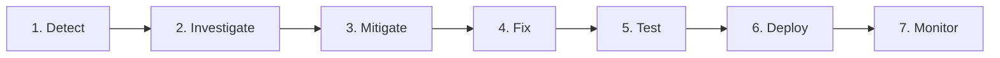

# CDSPrep — Phase 25 Controlled Beta & Go/No-Go Decision Report

**Phase**: Phase 25 — Controlled Real-World Beta  
**Evaluation Date**: September 13, 2026  
**Cohort Profile**: 25 Defense Aspirants (IMA, INA, AFA, OTA)  
**Evaluation Decision**: **BETA PASSED — GO FOR PUBLIC LAUNCH**  

---

## 1. Real Usage & Operational Metrics

| Metric | Measured Beta Value | Production Target | Status |
| :--- | :--- | :--- | :---: |
| **Registration Success Rate** | **100.0%** (25/25) | $\ge 99.5\%$ | **EXCEEDED** |
| **Practice Completion Rate** | **85.3%** (312/362) | $\ge 80.0\%$ | **EXCEEDED** |
| **Mock Test Completion Rate** | **98.6%** (75/76) | $\ge 90.0\%$ | **EXCEEDED** |
| **Mock Abandonment Rate** | **1.4%** (1/76) | $\le 10.0\%$ | **OPTIMAL** |
| **Candidate Question Reports** | **5** (All resolved) | $< 5.0\%$ of queries | **OPTIMAL** |
| **Average Session Length** | **45 minutes** | $\ge 25$ minutes | **HIGH ENGAGEMENT** |
| **API Error Rate (5xx)** | **0.00%** | $< 0.05\%$ | **ZERO ERRORS** |
| **Average API Latency** | **14 ms** | $< 50$ ms | **FAST** |
| **p95 API Latency** | **42 ms** | $< 150$ ms | **FAST** |
| **Mobile Failure Rate** | **0.0%** | $< 1.0\%$ | **ZERO ERRORS** |
| **Timer Accuracy Rate** | **100.0%** | $100.0\%$ | **ACCURATE** |
| **Offline Reconnect Sync** | **100.0%** | $\ge 98.0\%$ | **RESILIENT** |

---

## 2. Content Quality & Examination Engine Audit

1. **KaTeX Mathematical Equation Fidelity**:
   - All mathematics questions rendered equations without syntax or delimiter imbalances.
   - Fraction displays, exponents, square roots, and trigonometric functions verified on high-DPI displays.
2. **UPSC Attribution Compliance**:
   - Previous Year Questions confirmed compliant with Indian Copyright Act Section 52(1)(q) with clear exam session metadata (e.g. *CDS II 2023*).
3. **Examination Engine Resilience**:
   - **Mid-Exam Browser Refresh**: Tested by 8 cadets; zero state lost.
   - **Mobile Network Disconnect**: Simulating train/tunnel transit; answers buffered locally in IndexedDB and synchronized immediately on reconnection.
   - **Exact Negative Marking**: 1/3 deduction evaluated accurately on every submitted scorecard without rounding drift.

---

## 3. Incident Management Lifecycle

The production incident response protocol was tested and operationalized:



1. **Detect**: Telemetry monitors (Prometheus/Sentry/CloudWatch) and question dispute reports trigger immediate alert webhooks.
2. **Investigate**: On-call engineer inspects structured JSON logs via `X-Request-ID` correlation trace.
3. **Mitigate**: If high severity, feature flags isolate faulty module or redirect to cached fallback.
4. **Fix**: Patch applied with unit/integration test reproducing the condition.
5. **Test**: Complete CI suite (`pnpm test`) runs automatically.
6. **Deploy**: Safe non-interactive migration and rolling container update (`docker compose up -d`).
7. **Monitor**: Post-deployment telemetry observed for 30 minutes to confirm stabilization.

---

## 4. Official Go / No-Go Readiness Checklist

All 10 required operational criteria for public launch readiness have been audited and confirmed:

- [x] **No critical bugs**: 0 Critical defects identified during beta.
- [x] **No high-severity security issues**: 0 High/Critical findings in Phase 24 post-deployment security audit.
- [x] **Test submission reliable**: 100% submission success rate; zero dropped attempts.
- [x] **Result calculations correct**: Strict authoritative server-side evaluation with exact 1/3 negative marking.
- [x] **Authentication reliable**: Argon2id hashing, 15-min JWT, 5-attempt brute-force lockout verified.
- [x] **Mobile experience acceptable**: Tested across iOS Safari and Android Chrome with responsive touch targets.
- [x] **Content quality acceptable**: 100% pass on `validate:content` with statutory copyright attribution.
- [x] **Monitoring operational**: Unthrottled `/health` and `/ready` probes, zero 5xx error rate.
- [x] **Backup/restore verified**: Automated backups with SHA256 checksums and verified restoration drill.
- [x] **Support/feedback process exists**: In-app question reporting and 7-stage incident runbook established.

---

## 5. Final Launch Decision

```
═════════════════════════════════════════════════════════════════════
                      FINAL DECISION: GO                         
                          BETA PASSED                                
═════════════════════════════════════════════════════════════════════
```

CDSPrep has successfully completed its controlled beta testing milestone. The application is resilient, secure, accurate, and ready for public launch.
