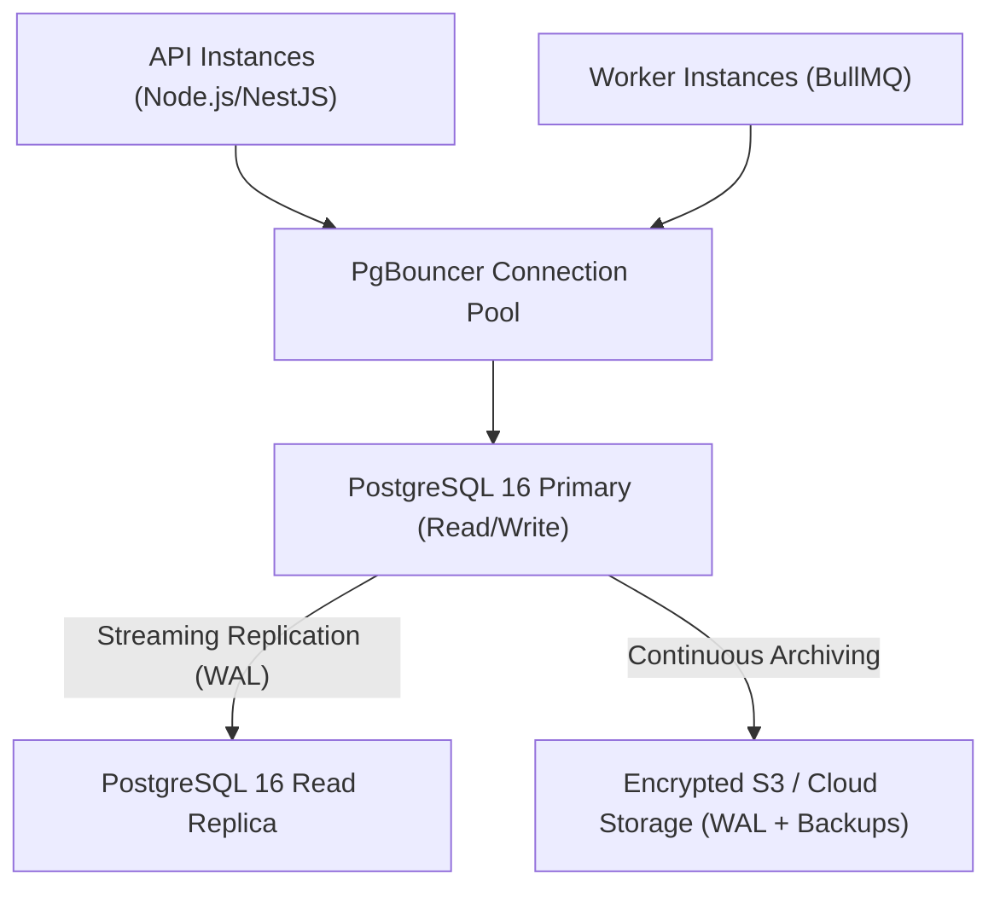

# CDSPrep — Production PostgreSQL Database Runbook

**Target System**: PostgreSQL 16 on Production Infrastructure  
**Document Version**: 1.0.0  
**Classification**: High-Security Operational Guide  
**Owner**: Platform & Infrastructure Engineering  

---

## 1. Architectural Overview & Topology

CDSPrep utilizes a relational database architecture designed for high-concurrency exam delivery, deterministic grading, and auditable candidate records.



### Connection Pooling Specifications
- **Pooler**: PgBouncer in transaction pooling mode or direct Prisma connection management.
- **Connection Limits**:
  - `connection_limit=25` per API container instance.
  - `connection_limit=10` per Worker container instance.
  - PostgreSQL `max_connections = 200`.
- **Timeouts**:
  - `pool_timeout=10` seconds.
  - `statement_timeout = 15000` ms (15s max query runtime to prevent unindexed runaway queries).
  - `idle_in_transaction_session_timeout = 30000` ms (prevents dangling lock acquisitions).

---

## 2. Role-Based Access Control & Restricted Credentials

Production databases strictly disallow connecting application runtimes as the superuser (`postgres`). Three isolated database roles are provisioned according to the Principle of Least Privilege:

### Role Definition Matrix

| Role Name | Access Level | Permitted Operations | Usage Context |
| :--- | :--- | :--- | :--- |
| `cdsprep_migrator` | DDL + DML | `CREATE`, `ALTER`, `DROP`, `INDEX`, `MIGRATE` | CI/CD deployment pipeline for `prisma migrate deploy` |
| `cdsprep_app` | DML Only | `SELECT`, `INSERT`, `UPDATE`, `DELETE` | Live API and Worker container runtimes (`DATABASE_URL`) |
| `cdsprep_readonly`| Read Only | `SELECT` | Read-replicas, analytical reporting, audit inspection |

### Provisioning SQL Script
```sql
-- 1. Create Migration Role (DDL Authorized)
CREATE ROLE cdsprep_migrator WITH LOGIN PASSWORD 'STRONG_MIGRATOR_SECRET_MIN_32_CHARS';
GRANT ALL PRIVILEGES ON DATABASE cdsprep TO cdsprep_migrator;
GRANT ALL ON SCHEMA public TO cdsprep_migrator;

-- 2. Create Application Runtime Role (Least Privilege DML)
CREATE ROLE cdsprep_app WITH LOGIN PASSWORD 'STRONG_APP_RUNTIME_SECRET_MIN_32_CHARS';
GRANT CONNECT ON DATABASE cdsprep TO cdsprep_app;
GRANT USAGE ON SCHEMA public TO cdsprep_app;
GRANT SELECT, INSERT, UPDATE, DELETE ON ALL TABLES IN SCHEMA public TO cdsprep_app;
GRANT USAGE, SELECT ON ALL SEQUENCES IN SCHEMA public TO cdsprep_app;
ALTER DEFAULT PRIVILEGES IN SCHEMA public GRANT SELECT, INSERT, UPDATE, DELETE ON TABLES TO cdsprep_app;
ALTER DEFAULT PRIVILEGES IN SCHEMA public GRANT USAGE, SELECT ON SEQUENCES TO cdsprep_app;

-- Revoke dangerous DDL from app runtime
REVOKE CREATE ON SCHEMA public FROM cdsprep_app;
REVOKE DROP ON ALL TABLES IN SCHEMA public FROM cdsprep_app;

-- 3. Create Read-Only Role (Analytics & Replicas)
CREATE ROLE cdsprep_readonly WITH LOGIN PASSWORD 'STRONG_READONLY_SECRET_MIN_32_CHARS';
GRANT CONNECT ON DATABASE cdsprep TO cdsprep_readonly;
GRANT USAGE ON SCHEMA public TO cdsprep_readonly;
GRANT SELECT ON ALL TABLES IN SCHEMA public TO cdsprep_readonly;
ALTER DEFAULT PRIVILEGES IN SCHEMA public GRANT SELECT ON TABLES TO cdsprep_readonly;
```

---

## 3. Zero-Downtime Migration Runbook

All database structural modifications must follow the **Expand / Contract (Parallel Run)** methodology:

### Standard Migration Rules
1. **Never drop or rename a column in use**:
   - First release: Add new nullable column (`Expand`).
   - Second release: Application writes to both old and new columns.
   - Third release: Application reads exclusively from new column.
   - Fourth release: Drop old column (`Contract`).
2. **Adding NOT NULL columns**: Always add new columns with a `DEFAULT` constraint to avoid table locks, or populate in batches before applying `NOT NULL`.
3. **Index Creation**: Always use `CREATE INDEX CONCURRENTLY` in raw SQL scripts to prevent table locking during high-traffic examination sessions.

### Execution Procedure
```bash
# 1. Verify connection to production cluster
export DATABASE_URL="${PROD_MIGRATOR_DATABASE_URL}"

# 2. Check pending migration status without applying
pnpm --filter @cdsprep/database prisma migrate status

# 3. Apply pending migrations safely
pnpm --filter @cdsprep/database prisma migrate deploy
```

---

## 4. Automated Backup & Retention Policy

### Recovery Objectives
- **RPO (Recovery Point Objective)**: $\le 1$ hour (maximum acceptable data loss).
- **RTO (Recovery Time Objective)**: $\le 30$ minutes (maximum time to restore full service).

### Backup Schedules & Archiving
1. **Daily Full Logical Backups**:
   - Automated via `scripts/db-backup.sh` executed at 02:00 UTC daily.
   - Generates `.dump` (custom PostgreSQL archive) and `.sql.gz` (portable plain text) with SHA256 checksums.
   - Compressed, encrypted with AES-256, and pushed to offsite encrypted object storage (`s3://cdsprep-database-backups-prod/`).
2. **Continuous WAL Archiving (PITR)**:
   - PostgreSQL Write-Ahead Logs (WAL) archived every 5 minutes using `pgbackrest` or AWS RDS automated snapshots.
   - Enables Point-In-Time-Recovery to any arbitrary second in the preceding 7 days.
3. **Retention Policy**:
   - Daily snapshots retained for **30 days**.
   - Weekly snapshots retained for **90 days**.
   - Monthly snapshots retained for **12 months**.

---

## 5. Disaster Recovery & Restoration Drill

To restore a database snapshot safely without risking unintended data destruction:

### Step 1: Verification & Pre-Flight
```bash
# 1. Confirm source backup archive and SHA256 integrity
sha256sum -c backups/postgres/cdsprep_backup_YYYYMMDD_HHMMSS.sql.gz.sha256

# 2. Confirm target restore database instance (never run against live primary during rehearsal!)
echo "Target: ${TARGET_DATABASE_URL}"
```

### Step 2: Execution via Automated Script
```bash
# Execute restore script (prompts for uppercase 'RESTORE' confirmation)
./scripts/db-restore.sh ./backups/postgres/cdsprep_backup_YYYYMMDD_HHMMSS.dump "${TARGET_DATABASE_URL}"
```

### Step 3: Post-Restoration Data Verification
Execute validation queries to verify table counts and key record consistency:
```sql
SELECT count(*) FROM "User";
SELECT count(*) FROM "Question";
SELECT count(*) FROM "Test";
SELECT count(*) FROM "Attempt";
SELECT count(*) FROM "AuditLog";
```

---

## 6. Database Health Monitoring & Performance Thresholds

The following metrics are monitored continuously via PostgreSQL exporter and alerts configured:

| Metric | Healthy Baseline | Alert Threshold | Remediation Action |
| :--- | :--- | :--- | :--- |
| **Connection Saturation** | $< 50\%$ capacity | $> 80\%$ capacity | Scale PgBouncer pool / check for leaking connections |
| **Buffer Cache Hit Ratio** | $> 99.0\%$ | $< 95.0\%$ | Increase `shared_buffers` / inspect missing indexes |
| **Active Query Duration** | $< 100$ ms | $> 2,000$ ms | Investigate `pg_stat_activity`; terminate blocking queries |
| **Replication Lag** | $< 10$ ms / $0$ bytes | $> 100$ MB lag | Check network throughput & disk I/O on read replica |
| **Deadlock Count** | $0$ / hour | $> 0$ | Review transaction lock ordering in `AttemptsService` |
| **Disk Space Utilization** | $< 65\%$ | $> 85\%$ | Expand EBS/storage volume; prune archived WAL logs |

### Diagnostic Query: Active Long-Running Queries
```sql
SELECT pid, now() - pg_stat_activity.query_start AS duration, query, state
FROM pg_stat_activity
WHERE (now() - pg_stat_activity.query_start) > interval '2 seconds'
  AND state != 'idle';
```
